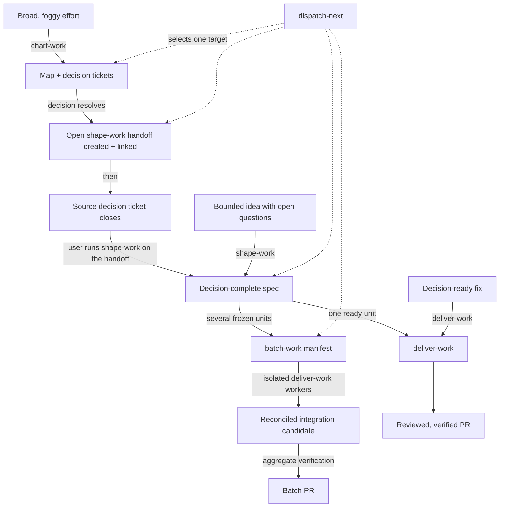

# The work loop

The delivery workflows compose into one route from fog to a merged pull request. Each hands over
only when its own kind of uncertainty is gone; `dispatch-next` sits beside the route and selects one
entry.

## Where to enter

Enter at [`chart-work`](/skills/chart-work) when the effort spans several decision threads or
sessions and you cannot yet phrase the questions precisely. Enter at
[`shape-work`](/skills/shape-work) when the change is bounded but its product decisions are still
open. Enter at [`batch-work`](/skills/batch-work) when several units are already decision-complete
and dependency-mapped. Enter at [`deliver-work`](/skills/deliver-work) for one ready unit.

Entering too high costs a round of ceremony. Entering too low is worse: `deliver-work` will detect
several interdependent open product decisions during its readiness step and halt, routing you back to
`shape-work` rather than quietly becoming a second interview.

## Handover rules

A chart-work branch **graduates** when its remaining product decisions fit inside a single shape-work
interview. Before the canonical source decision closes, chart-work creates or reuses exactly one open
shape-work handoff, links it from the map and source receipt, and keeps it as the next work object.
The handoff carries the branch's decision receipts and prototype artifacts, names only the remaining
questions, and says `Run shape-work on this handoff.` Chart-work waits for that user-controlled
invocation. `shape-work` reads the handoff and does not re-litigate settled decisions.

A spec is **decision-complete** when every open product question is either answered or listed
explicitly as deferred with an owner. That is the contract `deliver-work` relies on — it does not
make product decisions, so a hidden open question would resurface as an implementation guess.

For one implementation unit, the spec routes to `deliver-work`. For several units with stable
dependencies, scopes, authority and checks, it routes to `batch-work`. Batch planning creates one
durable manifest and halts for explicit approval before any worker or worktree. Approval freezes task
hashes; definition drift returns to the checkpoint.

Neither handover authorizes implementation on its own. Map approval authorizes map children,
capture-only spawned issues, and creation of the planning-only shape-work handoff. It authorizes
neither shaping nor implementation. Product mutation begins only at a matching `deliver-work`
checkpoint, reached through direct approval or a live hash-bound batch approval.

## Disciplines run underneath

The three disciplines are not steps in this route; they apply wherever their situation occurs.

[`diagnose-before-fix`](/skills/diagnose-before-fix) keeps production files unchanged until evidence
supports a root cause, because an early patch destroys the information you need to find the real one.
[`scope-guard`](/skills/scope-guard) classifies each discovery as required, adjacent or conflicting,
and only required work stays in the current diff. [`verify-before-done`](/skills/verify-before-done)
sits at the boundary where the agent is about to claim something is finished, and demands fresh
evidence of the matching class for every material claim.

`deliver-work` names two of them directly in its implementation step, but they hold in an ordinary
session with no workflow running at all.

## Picking work instead of doing it

[`dispatch-next`](/skills/dispatch-next) is the entry point when the question is "what next?" rather
than "how?". It reads live GitHub state, prioritizes work already in flight over anything new, selects
exactly one target, and outputs the target, the motivation, the proposed role and the proposed next
action. Then it stops. It routes an open decision ticket to `chart-work`, a graduated branch to
`shape-work`, an approved or resumable batch manifest to `batch-work`, and one decision-complete
implementation unit to `deliver-work`.

Its default mode is shadow: read-only GitHub commands, zero mutations. The command log of a shadow
run is the acceptance evidence, which is why the restriction is phrased as a hard rule rather than a
preference.
