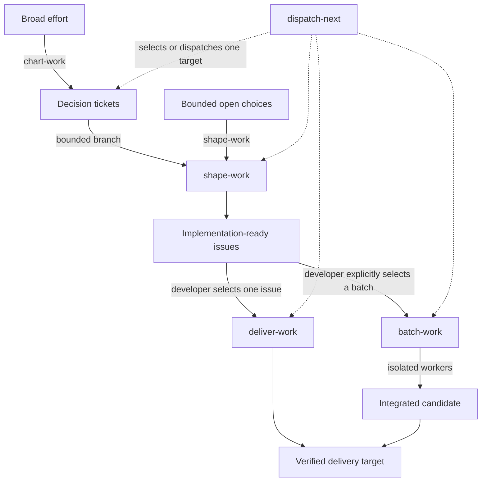

# The work loop

Enter at the lowest workflow that matches the uncertainty.



Use `chart-work` when several decision threads can move independently. Use `shape-work` for one
bounded set of product choices and to materialize its implementation-ready issues. Use
`deliver-work` for one selected ready issue. Use `batch-work` only when the developer explicitly
chooses integrated execution of several ready issues with stable dependencies.

Each workflow inherits the same authority rule: the request governs what happens. Planning requests
produce planning artifacts. Execution requests may mutate repository files in scope. Delivery stops
at the requested or policy-defined boundary.

The automatic disciplines run underneath:

- `diagnose-before-fix` establishes a supported cause for unknown failures;
- `scope-guard` contains required, adjacent, and conflicting discoveries;
- `verify-before-done` matches material completion claims to fresh evidence.

Durable records are optional working memory. Use them when sessions or parallel work need recovery,
not to prove that ceremony occurred.

## Worked example: filtered CSV export

The request begins as fog:

> Add export to reports. It should be safe and work for large customers.

### 1. chart-work separates the decisions

`chart-work` creates a small map and three **decision tickets**. A decision ticket owns one question,
its evidence, and the resulting decision.

| Ticket | Question | Evidence | Decision |
|---|---|---|---|
| EXP-1 | What is exported? | Current filter model and support requests | CSV of the active filtered result |
| EXP-2 | Who may export? | Existing report authorization tests | Reuse report-view permission |
| EXP-3 | What counts as large? | Production row-count sample | Synchronous through 10,000 rows; larger exports are out of scope |

The artifact is `planning/report-export/map.md` plus the three tickets. The broad request is now one
bounded branch with settled product decisions.

### 2. shape-work makes the branch executable

`shape-work` follows those tickets, settles the product shape, and creates implementation-ready
issues:

```text
Outcome: A permitted user downloads the active report filter as UTF-8 CSV.
Boundaries: No scheduled exports, background jobs, or new permission model.
Ground truth: API contract test + rendered download flow + unauthorized request test.
Delivery: One pull request; no merge or deployment.

Implementation issues:
EXPORT-API  -> serializer, endpoint, authorization tests
EXPORT-UI   -> download action, loading and error states
EXPORT-E2E  -> depends on EXPORT-API + EXPORT-UI

Ready frontier: EXPORT-API, EXPORT-UI
```

**Ground truth** is the observation that can decide the claim. “The build passes” is not ground truth
for a browser download.

The three issues are the required shaping output. They exist regardless of whether the developer
later chooses serial delivery or a batch.

### 3. The developer chooses batch-work

For this example, the developer explicitly asks to run the ready issue graph as an integrated batch:

```text
/agent-os:batch-work Execute the report-export implementation issues as one integrated batch.
```

`batch-work` consumes the existing issues and records execution definitions, dependencies, hashes,
worker commits, and aggregate checks in `.agent-os/batches/report-export.md`. API and UI run in
isolated workspaces. E2E waits. Without that explicit batch request, the same issues remain available
for individual `deliver-work` runs.

### 4. deliver-work produces evidence

Each worker uses `deliver-work` against its task outcome, boundaries, and checks, then returns a
commit and evidence. The coordinator integrates API and UI once, releases E2E, and reruns the
aggregate download path on the integrated candidate.

The batch is **reconciled** when the current task definitions, returned commits, integrated files,
and dependency state agree. It is not delivered yet. Delivery follows only after the aggregate
ground truth passes:

```text
Command: npm test -- report-export
Exit: 0
Result: API, authorization, and CSV encoding cases pass.

Command: npm run test:e2e -- report-export
Exit: 0
Result: filtered CSV downloads; unauthorized export is rejected.
```

The final artifact is one verified pull request. Merge and deployment remain outside the request.
