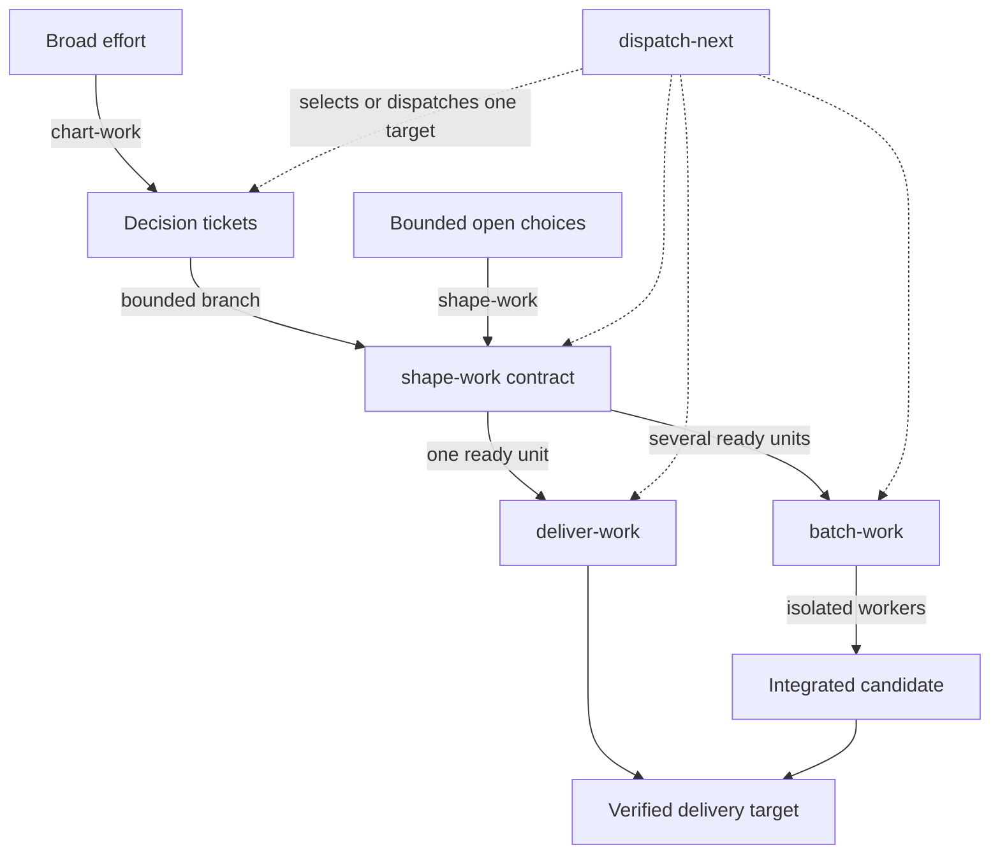

# The work loop

Enter at the lowest workflow that matches the uncertainty.

Use `chart-work` when several decision threads can move independently. Use `shape-work` for one
bounded set of product choices. Use `batch-work` for several decision-ready units with stable
dependencies. Use `deliver-work` for one ready change.

Each workflow inherits the same authority rule: the request governs what happens. Planning requests
produce planning artifacts. Execution requests may mutate repository files in scope. Delivery stops
at the requested or policy-defined boundary.

The automatic disciplines run underneath:

- `diagnose-before-fix` establishes a supported cause for unknown failures;
- `scope-guard` contains required, adjacent, and conflicting discoveries;
- `verify-before-done` matches material completion claims to fresh evidence.

Durable records are optional working memory. Use them when sessions or parallel work need recovery,
not to prove that ceremony occurred.
