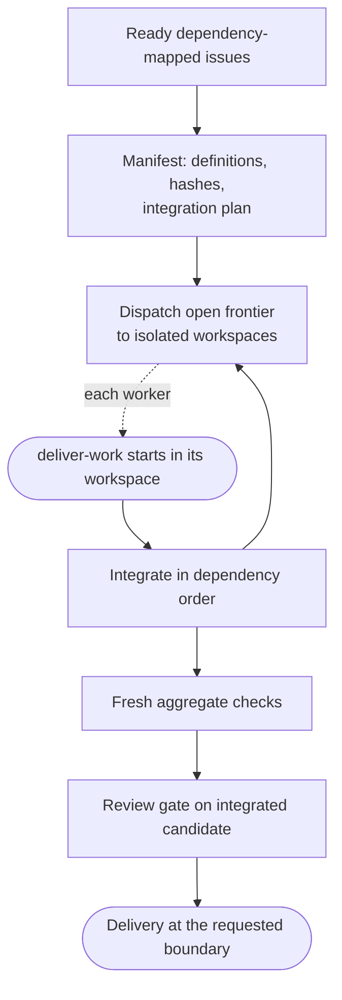

# batch-work

**Bucket:** workflow · **Invocation:** manual · `/agent-os:batch-work` or `$batch-work`

Plans and runs several decision-ready units through isolated workers and aggregate verification.
Each worker is simply [deliver-work](/skills/deliver-work) starting in an isolated workspace.

Batch-work consumes an existing set of implementation-ready, dependency-mapped issues. It does not
discover or decompose the product shape, and several issues do not invoke it automatically. The
developer explicitly chooses when the issue graph should run as an integrated batch.

The request decides whether the workflow plans, executes, or does both. A planning-only request
creates the manifest and stops. An execution request continues without a second approval checkpoint.

Each task has a stable key, outcome, scope, dependencies, checks, and definition hash. Independent
frontier tasks run in isolated branches and worktrees. Workers return concise results; the
coordinator owns the manifest and integration branch.

After each integration the coordinator reruns relevant checks. After all tasks integrate, fresh
aggregate checks decide whether the complete candidate is ready. Worker-local success is never a
substitute for integrated behavior.

An executed batch is material. The coordinator applies the
[deliver-work review gate](/skills/deliver-work#review-without-a-review-panel) to the integrated
candidate before delivery, resolves supported findings, and reruns affected aggregate checks.

Definition drift invalidates an affected result. Merge, deploy, destructive cleanup, and external
effects follow the request or project policy.

See [Batch manifests](/reference/batches).
