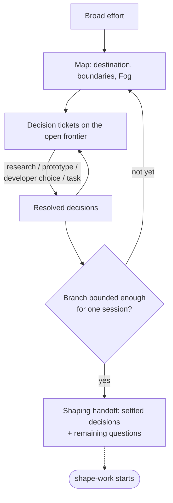

# chart-work

**Bucket:** workflow · **Invocation:** manual · `/chart-work` (direct Claude), `/agent-os:chart-work` (Claude plugin), or `$chart-work` (Codex)

Charts broad work as a parallel graph of evidence-backed decision tickets. It builds on
[shape-work](/skills/shape-work): a bounded branch ends exactly where shape-work begins.



The invocation authorizes writes to the configured planning surface. It does not authorize product
implementation.

Name the destination and boundaries, create tickets for precise questions, leave immature unknowns
in Fog, connect dependencies, and expose the open frontier. The ticket is canonical; the map is a
repairable index.

Resolve tickets with evidence suited to the question: repository research, a prototype, a developer
decision, or a prerequisite task. Human preference evidence must come from the developer.

Independent frontier tickets may run in parallel. Reconcile the map without overwriting canonical
ticket results. When a branch becomes bounded, create or reuse one linked `shape-work` handoff with
settled decisions and remaining questions. The handoff moves the branch to shaping, not to
delivery-ready. Shape-work later creates the implementation issues and reconciles their links and
frontier into the map. A selected branch in shaping keeps the map open; the map closes only when
selected paths are delivery-ready, parked, or ruled out and no Fog remains.

See [Maps and decision tickets](/reference/maps-and-tickets) and
[Prototype evidence](/reference/prototypes).

## Transcript: fog becomes a frontier

Condensed illustration; the full worked example lives in [The work loop](/guide/the-work-loop).

```text
User:
/chart-work Add export to reports. It should be safe and
work for large customers.

Agent:
Destination: permitted users take report data with them.
Boundaries: no scheduled exports, no new permission model.

Tickets:
  EXP-1 What is exported?        evidence: research (filter model, support requests)
  EXP-2 Who may export?          evidence: research (existing authorization tests)
  EXP-3 What counts as large?    evidence: research (production row counts)

Fog: retention rules for exported files — too immature for a ticket.

Open frontier: EXP-1, EXP-2, EXP-3 are independent and can run in
parallel. Written to planning/report-export/. No product code changed.
```
