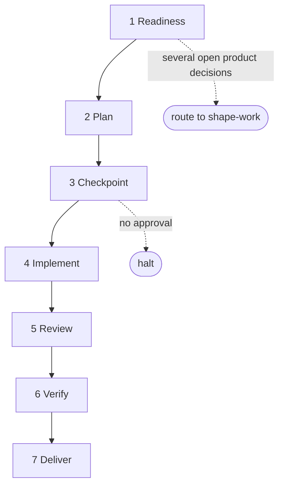

# deliver-work

**Bucket:** workflow · **Invocation:** manual · `/agent-os:deliver-work` or `$deliver-work`

Takes one decision-ready unit or focused fix through implementation, review, verification and its
delivery boundary, including as a batch worker. Use it when work is ready to build. For exploration or specification-only work, use
[`shape-work`](/skills/shape-work) instead.

The skill runs one visible step at a time, so later work cannot pull attention past the current gate.
Each step lives in its own file, and only the step named by the active work record is loaded.

## The sequence

**1 — Readiness.** Read the request, project policy, branch and working-tree state, preserving
user-owned changes. Resolve facts from the repo or tools, and put only product, risk, security, data
or irreversible decisions to the user. One unresolved decision with two plausible answers gets asked
with a recommendation; several interdependent open product decisions route the work to `shape-work`,
because deliver-work does not become a second interview. Classify the work as `one-shot` (clear
intent, zero plausible blast radius, no product or architecture decision) or `tracked` — uncertainty
selects tracked. A batch-owned launch additionally validates its manifest identity, task and
approved manifest hashes, attempt, baseline, scope, states and local commit-plus-receipt boundary
before product mutation.

**2 — Plan.** Investigate the affected code before proposing mutations, then define the goal,
non-goals, acceptance criteria, exact intended mutations, risks and verification commands. Name the
smallest public test seams that cover the important behavior; the checkpoint approves those seams, and
implementation must not invent a second testing contract. Tracked frontend work includes the required
mockup, tracked backend work a Mermaid flow. Tracked work creates a
[work record](/reference/work-records); one-shot work creates no artifact.
Batch-owned work copies its plan from the frozen task definition; scope expansion returns to the
batch checkpoint.

**3 — Checkpoint.** One-shot work reconfirms its classification. Tracked work requires explicit
approval — either the user responds to the presented plan with approval, or the invoking instruction
explicitly said to run the whole workflow without a checkpoint, in which case the exact bypass
sentence is recorded. Requests to build, implement, complete or continue are task intent, not
approval. A live hash-bound batch approval may satisfy this checkpoint only for the exact frozen
task, approved manifest hash and attempt recorded in the manifest.

**4 — Implement.** Capture `HEAD` as the baseline, then work in vertical slices at the approved test
seams: make the behavior red, add the smallest sufficient implementation, make it green, continue.
[`diagnose-before-fix`](/skills/diagnose-before-fix) applies to bugs and
[`scope-guard`](/skills/scope-guard) throughout. Finish with a self-review, then freeze one review
target: baseline, exact changed and untracked file list, and a SHA-256 snapshot hash.

**5 — Review.** Run the independent [review loop](/reference/review-loop) against the frozen target at
proportional depth, classify findings by evidence, send only validated findings to one fixer, allow at
most one targeted re-review, and write the review receipt. Evidence-supported out-of-scope findings
are typed as `product`, `cleanup`, or `harness`; harness candidates carry failure evidence, recurrence
risk, an enforcement layer, red case, proposed guardrail, and removal condition. All three kinds
stay out of the diff and pause review for one explicit choice: create ordinary backlog issues for all
or a selected subset, or leave them unfiled.

**6 — Verify.** Apply [`verify-before-done`](/skills/verify-before-done) to the resulting candidate,
not the pre-fix snapshot. Run every planned verification plus the regression checks added during
review, and trace each acceptance criterion to fresh evidence of the matching class — user-visible,
rendered, accessibility, external-system and manual requirements need evidence of that exact class,
and substitute checks do not count.

**7 — Deliver.** Ordinary work commits, pushes and opens or updates a PR. A batch-owned worker
rechecks both task and approved manifest hashes, commits only to its isolated task branch, and
returns the complete receipt to the coordinator; it does not push, open a PR, merge, edit the
manifest or touch the integration branch. Ordinary merge still requires project or session
authority. After either delivery boundary, propose — but do not write — any durable project-policy
lesson.

## Completion

The workflow is complete only when the delivery step reports `delivered`, or names the exact blocked
transition. A summary, implementation progress, or green tests alone never advance state.
