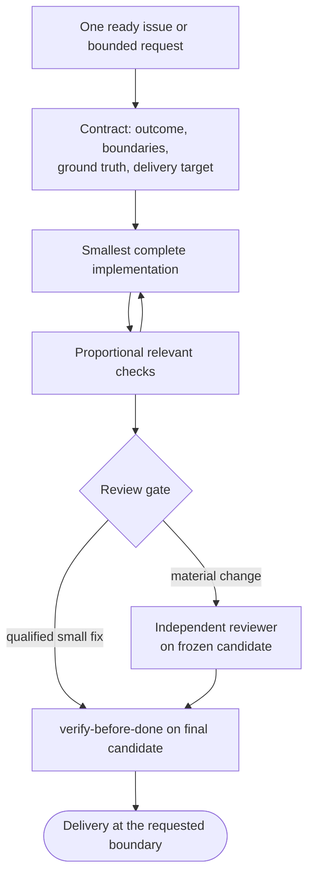

# deliver-work

**Bucket:** workflow · **Invocation:** manual · `/deliver-work` (direct Claude), `/agent-os:deliver-work` (Claude plugin), or `$deliver-work` (Codex)

Delivers one decision-ready change against explicit boundaries and ground truth.

## Authority follows the request

An implementation request authorizes repository changes inside its scope. Planning and review
requests remain read-only apart from their requested artifacts. Merge, deploy, destructive cleanup,
and effects on external systems or people require the request or project policy to include them.

## Contract

Before editing, establish:

- the observable outcome;
- boundaries and non-goals;
- tests or observations that decide success;
- the requested delivery target.

The target must be one coherent implementation issue or equivalently bounded request: one
observable outcome, one reviewable change boundary, explicit ground truth, and satisfied
dependencies. An unshaped target with several separately closable outcomes or delivery boundaries returns to
shaping before mutation. An explicitly authorized set of already shaped issues can proceed
sequentially, applying the delivery contract and rechecking readiness for each unit. Reuse the active
quality baseline across the sequence and refresh candidate checks instead of starting it again. Deliver-work never chooses batch execution for the developer.

Then inspect, start the available [quality-ratchet](/skills/quality-ratchet) baseline before the
first mutation, classify review, implement, check the candidate, adapt, review the diff, and verify
the final candidate. The ratchet allows bounded behavior-preserving improvement on the touched
surface, but its raw counts are evidence rather than gates. Run its candidate check before the
semantic review and pass the evidence to that review. Diff review automatically applies the
[simplifier-review](/skills/simplifier-review) lens before the candidate is frozen, so supported
unnecessary code and solution layers are removed rather than carried into delivery. Test selection applies
[proportional-testing](/skills/proportional-testing): protect the changed behavior and plausible
regressions with the minimum meaningful test surface, while retaining required delivery checks. The
agent chooses the local method.

## Review without a review panel

Independent review is the default. It may be skipped only for a localized, low-risk fix that adds no
capability, crosses no public or sensitive boundary, and has direct regression evidence.

For material work, the agent confirms that the current session has a real reviewer launch tool before
editing. A wait tool alone is not sufficient. Without a launch mechanism, the workflow stops before
mutation with a review-required handoff.

Required review uses at least one read-only reviewer in a separate context against a frozen
candidate. Its scope includes correctness, unnecessary solution complexity, scope, and material
risk. One general evidence-based reviewer is enough by default. Add a focused security or compatibility
reviewer only when a distinct risk needs it.

The reviewer identity must come from a successful launch-tool result in the current run. On Codex,
`spawn_agent` returns the identity used to correlate the reviewer result. Follow the host wait-tool
schema; some hosts wait on a mailbox without an ID parameter. Empty receiver IDs and
implementer-written `/root/...` labels are not review. The result records reviewer identity and role,
candidate identity, scope, findings, and disposition. Supported required findings are fixed and re-reviewed
before final verification. Implementers may reject unsupported preferences with evidence; optional
follow-ups do not block approval. Re-review targets fixes and their plausible regressions, not a
new round of unrelated preferences. Refresh active quality evidence after the final correction. If no independent reviewer can run, delivery stops with a review handoff;
self-review is not presented as independent review.

Ask only when an unresolved product decision would materially change the outcome. Reversible
implementation choices belong to the implementer.

Ordinary work creates no state artifact. Work expected to span sessions may use a compact
[work record](/reference/work-records) as resumable working memory.

Batch workers stay in their assigned task workspace and return a commit SHA, changed files, checks,
and remaining uncertainty. The coordinator owns integration, aggregate review, and aggregate
verification.

Before implementation, look for existing behavior and contract owners through quality-ratchet.
Use a bounded experiment only for a solution-changing uncertainty that observation can settle.
At each unit boundary, recommend the next action and continue only while the original request
covers the remaining ready work. One authorized issue never grants authority for its whole epic.
