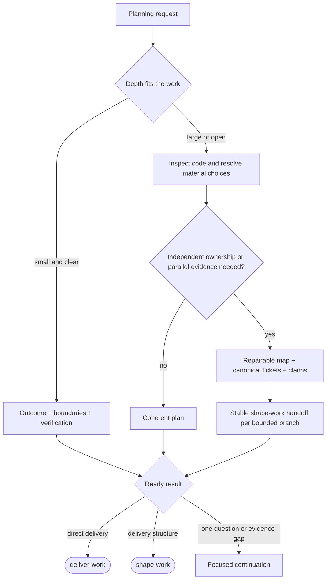

# plan-work

**Bucket:** workflow · **Invocation:** manual · `/plan-work` (direct Claude), `/agent-os:plan-work` (Claude plugin), or `$plan-work` (Codex)

Owns the coherent mission before delivery: desired result and behavior, boundaries, affected parts,
material decisions, technical feasibility, and one verification story for the whole result.



Plan-work chooses depth internally. A small clear fix needs only outcome, boundaries, and
verification. A large known change gets repository inspection and coverage across flows, states,
errors, and integrations. A bounded open choice gets facts first and focused questions. A broad
initiative uses the decision map only when independent ownership, separate evidence, or parallel
treatment makes it worthwhile.

Use [understand-work](/skills/understand-work) while the outcome is still moving. Use
[explain-work](/skills/explain-work) when a plain-language summary is needed for an actual decision;
summary approval is not a general gate. Planning is not mandatory before an already clear
implementation request, and shape-work accepts an existing specification.

## What the plan checks

Read the request, project policy, relevant repository code, existing planning artifacts, and live
state. Check main flows, states, error paths, and integrations against the real code. For a rebuild
or migration, state what is preserved, replaced, migrated, and removed. Do not invent requirements
to fill a template.

The plan is ready when implementation can proceed without inventing material product intent. It can
be ready for direct delivery, ready for shape-work, or paused at one explicit question or evidence
gap. Exact code, every file, and every internal work step do not need to be decided. Planning alone
does not start implementation; existing mandate continues across workflow boundaries.

## Decision-map mode

The canonical map and ticket contract lives in [Maps and decision tickets](/reference/maps-and-tickets)
and [`skills/plan-work/references/map.md`](https://github.com/sockulags/agent-os/blob/main/skills/plan-work/references/map.md).
The decision ticket owns its question, evidence, and resolution; the map is a repairable index.
Stable identities, idempotent retries, dependency links, claims before independent work,
compare-and-swap protection, and the open frontier keep parallel planning trustworthy. A map never
starts parallel workers automatically.

When a branch is bounded, create or reuse one `shape-work` handoff. It links the canonical plan and
ticket evidence instead of copying them into a competing specification. Shape-work reconciles issue
links and readiness back into the map.

### Reconsideration

An earlier resolution remains preserved and addressable. A reconsideration records which decision is
under review, why, and the question still open; it appears in the map and follows ordinary claim and
frontier rules. When it closes, it says whether the earlier decision was confirmed or replaced. A
replacement is registered only after a new decision is actually made. A linked issue is paused only
after actual impact through its acceptance or boundaries; independent authorized work continues.

## Authority and working memory

No planning skill grants tracker write access. An explicit tracker mandate may cover implementation
detail and technical ordering or readiness inside the authorized set, but not acceptance changes,
new owners or deliveries, or closure. A ready issue is not authorization. Without that mandate,
keep corrections local and report what needs syncing. If the information must survive a session, use
the compact [work record](/reference/work-records) and add `Pending tracker updates` only when
needed, as an unsynced delta rather than a plan copy.

Planning recommends one concrete next action and why it wins. The developer chooses whether to
continue into delivery or an explicit batch.

## Transcript: small work and broad work share one entry

```text
User:
/plan-work Add export to reports for large customers.

Agent:
The outcome is clear, but the repository shows open questions about
authorization and the large-result boundary. I will inspect those seams
and ask only if the evidence cannot settle them.

... repository evidence settles authorization; one product choice remains ...

Recommendation: disable export above the synchronous limit with an
explanation, rather than hiding the action. The visible boundary avoids
silent failure.

Plan ready for shape-work: one report-export mission, the affected API and
UI seams, aggregate download and authorization checks, and the remaining
delivery-unit boundary to shape.
```

The same entry can stop after a small fix contract or open a decision map; the depth follows the
work, not a user-selected ceremony.
