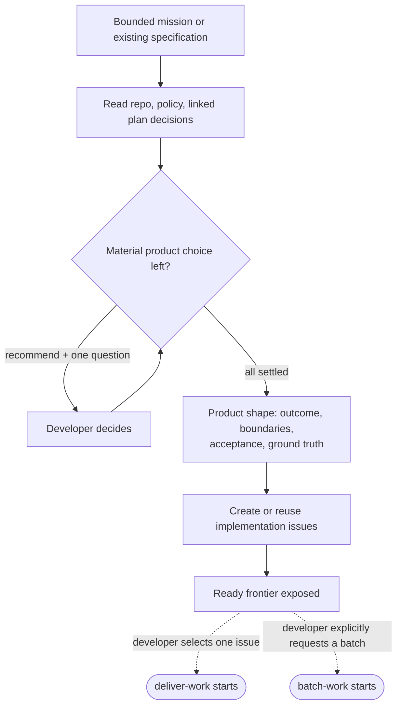

# shape-work

**Bucket:** workflow · **Invocation:** manual · `/shape-work` (direct Claude), `/agent-os:shape-work` (Claude plugin), or `$shape-work` (Codex)

Shapes a bounded mission into coherent delivery units and implementation-ready issues backed by
settled product decisions.



Read the repository, policy, and linked decisions before asking questions. Resolve discoverable
facts yourself. Ask only about product choices that materially change the outcome, always with a
recommendation and its consequence.

Use a diagram or mockup only when it makes behavior, layout, states, or boundaries easier to judge.
Frontend proposals follow [Frontend mockups](/reference/mockups).

Deliver the coherent product shape: outcome, boundaries, acceptance examples, affected seams,
ground truth, settled decisions, and open risks. Start from one coherent delivery unit and split
only for an independent result, ownership, migration, delivery, or material risk and verification
boundary. Separate commits, sessions, files, or technical layers are not enough. Keep schema, API,
UI, configuration, errors, and verification with the behavior they support. Then create or reuse
implementation issues on the configured planning surface, link real dependencies, and expose the
first claimable frontier.

One shape may produce one issue, several independent issues without an epic, or an epic with
children when one shared result needs an owner. Issue count does not select an execution workflow.
The developer may run any ready issue with `deliver-work`, or explicitly choose `batch-work` for
integrated parallel execution.

When shaping started from `plan-work`, reconcile issue links and readiness into the origin handoff
and map. A shaping handoff alone is not delivery-ready. Shape-work completes only when every selected
branch points to implementation-ready issues or is explicitly parked or rejected.

An epic contract records the shared outcome, acceptance, children or delivery units, aggregate
verification, and the owner of final verification. A child does not authorize siblings or close the
parent; green child checks are not aggregate verification. Deliver-work checks the whole result when
the request covers the epic, and batch-work reuses the same contract.

The invocation authorizes planning artifacts, not product code.

See [Implementation issues](/reference/implementation-issues).

## Transcript: one question, then issues

Condensed illustration of the recommend-then-ask pattern.

```text
User:
/shape-work Turn the report-export branch into ready issues.

Agent:
Settled from the tickets: CSV of the active filtered result, reuse
report-view permission, synchronous through 10,000 rows.

One product choice remains: what happens above the limit?
  a) hide the export action        — invisible, but users ask why it's gone
  b) disable it with an explanation — visible boundary, no silent failure
Recommendation: b. One sentence of UI copy, no new capability.

User:
b.

Agent:
Issues created on the planning surface:
  EXPORT-API  ready    serializer, endpoint, authorization tests
  EXPORT-UI   ready    download action, disabled state above limit
  EXPORT-E2E  blocked  depends on EXPORT-API + EXPORT-UI

Delivery frontier: EXPORT-API, EXPORT-UI. Execution is your choice —
deliver-work per issue, or batch-work if you ask for an integrated batch.
```

## Experiments and continuation

Use the [experiment decision](/reference/prototypes) for technical uncertainty or UI alternatives
that need observation. Routine choices with sufficient evidence need no prototype. Recommend one
concrete next action with a reason, not only the ready frontier. When the original request also
covers the bounded implementation, continue into sequential delivery; planning alone stops with
the recommendation.
